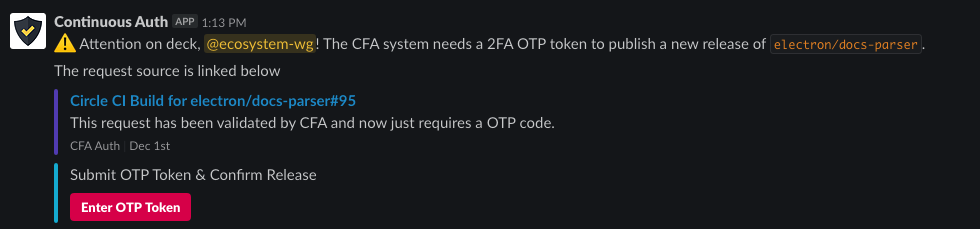
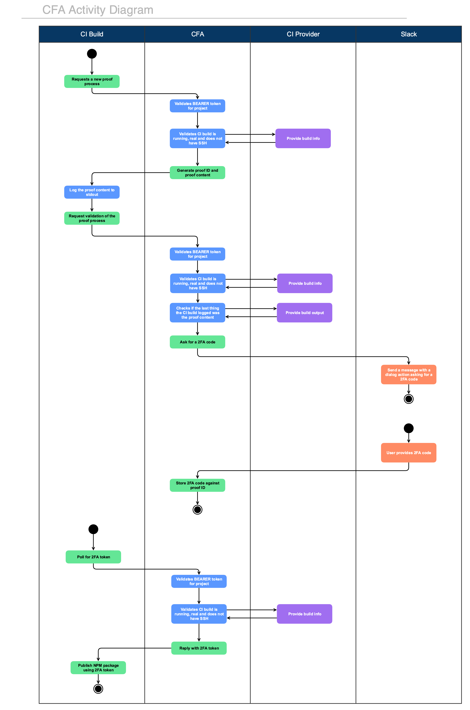

# CFA: Continuous Factor Authentication

This service is responsible for safely requesting and delivering a 2FA token to an arbitrary CI job. Typically though a tool like `semantic-release`.

## Usage

Head over to https://continuousauth.dev and sign in to start using CFA.  You can also check out our [usage documentation](https://docs.continuousauth.dev) for more information on how to use CFA and what it does.

## What does it look like?

Something like this:

## How does it work?

At a high level CFA is just a proxy for 2FA, in a 2FA model there is "something you know" and "something you have".  In the CFA model the "something you know" is still your NPM auth token, and the "something you have" is still the OTP generator.  CFA just safely mediates a connection between the CI build and you by validating the CI build through both a CFA token and by forcing the CI build to "prove" it is actually asking for a token.

Included below is a flow diagram which explains what CFA verifies and how it verifies it.  Other important parts of the code for this verification process can be found in each `Requester` implementation [`src/server/requesters`](src/server/requesters).

## Heroku Configuration

You should probably just use the hosted version of CFA at https://continuousauth.dev but if you really want to deploy it yourself these are things you need to do.

The following environment variables need to be set:

 * `PORT`: Which port to run on (`3000` by default)
 * `SLACK_CLIENT_ID`: Slack app id
 * `SLACK_CLIENT_SECRET`: Slack app secret
 * `SLACK_SIGNING_SECRET`: Slack app signing secret
 * `GITHUB_CLIENT_SECRET`: GitHub token that allows `electron-bot` to clone `electron`
 * `GITHUB_CLIENT_ID`: Same GitHub token as above
 * `SESSION_SECRET`: Secret to use for web UI session tokens
 * `DATABASE_URL`: In prod, use this to set a postgres connection URL

Optional variables:

 * `DEBUG`: Used by tons of modules used by the bot, set it to `*` for verbose output
